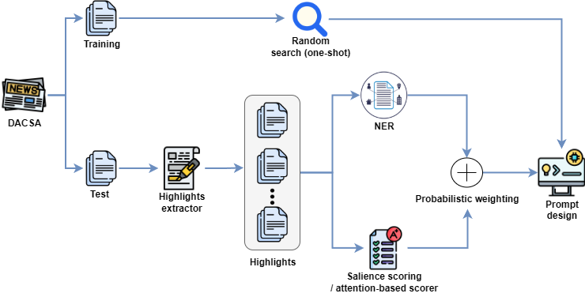

## Spanish LLM summarization
### Can LLMs Generate Coherent Summaries? Leveraging LLM Summarization for Spanish-Language News Articles

### TL-DR: Highlights

- Systematic evaluation of **Large Language Models (LLMs)** for **abstractive summarization of Spanish news** using the [DACSA](https://aclanthology.org/2022.naacl-main.434/) dataset.
- Comparison of four strategies:  
  1. **Fine-tuned seq2seq baselines** (mBART, mT5)  
  2. **Zero-shot prompting**  
  3. **One-shot prompting**  
  4. **Bottleneck prompting** combining attention-based salience and **NER-based entity highlights**. 
- Evaluation of multiple open LLMs (LLaMA-3.1, Gemma-2, Mistral, Mixtral, Qwen 2.5, Phi-3.5) under zero-shot, one-shot and bottleneck settings. 
- The **bottleneck + one-shot Gemma-2-9B** configuration achieves the best overall performance, surpassing fine-tuned mT5 in ROUGE-1/2 and semantic metrics. 
- Introduction of **BETOScore**, a Spanish-specific variant of BERTScore based on BETO embeddings, to better capture semantic similarity in Spanish summaries. 


### Authors

- **Ronghao Pan** — University of Murcia  
  [Google Scholar](https://scholar.google.com/citations?user=80lntLMAAAAJ) · [ORCID](https://orcid.org/0009-0008-7317-7145)

- **Tomás Bernal-Beltrán** — University of Murcia  
  [Google Scholar](https://scholar.google.com/citations?user=0bTUxQEAAAAJ&hl=en) · [ORCID](https://orcid.org/0009-0006-6971-1435)

- **María del Pilar Salas-Zárate** — Tecnológico Nacional de México / ITS Teziutlán  
  [Google Scholar](https://scholar.google.com/citations?user=2ssaDdsAAAAJ&hl=en) · [ORCID](https://orcid.org/0000-0003-1818-3434)

- **Mario Andrés Paredes-Valverde** — Tecnológico Nacional de México / ITS Teziutlán  
  [Google Scholar](https://scholar.google.com/citations?user=AYJZ7cEAAAAJ&hl=en) · [ORCID](https://orcid.org/0000-0001-9508-9818)

- **José Antonio García-Díaz** — University of Murcia  
  [Google Scholar](https://scholar.google.com/citations?user=ek7NIYUAAAAJ) · [ORCID](https://orcid.org/0000-0002-3651-2660)

- **Rafael Valencia-García** — University of Murcia  
  [Google Scholar](https://scholar.google.com/citations?user=GLpBPNMAAAAJ) · [ORCID](https://orcid.org/0000-0003-2457-1791)  

> **Affiliations:**  
> \* *Departamento de Informática y Sistemas, Universidad de Murcia, Campus de Espinardo, Murcia, Spain*  
> \* *Tecnológico Nacional de México / ITS Teziutlán, Puebla, Mexico*


### Publication
This work was published in **Applied Sciences** (MDPI):

- **Citation:** *Applied Sciences* 2025, 15(21), 11834  
- **DOI:** https://doi.org/10.3390/app152111834  
- **Publisher page:** https://www.mdpi.com/2076-3417/15/21/11834


### Abstract
Automatic summarization is crucial to handle the large volume of news articles produced every day.  
This paper investigates whether **Large Language Models** can generate **coherent and factually grounded summaries** of Spanish-language news, using the **DACSA** dataset as benchmark. :contentReference[oaicite:6]{index=6}  

We evaluate several strategies: **zero-shot prompting**, **one-shot prompting**, **fine-tuning** of seq2seq models (mBART, mT5), and a novel **bottleneck prompting** approach that integrates attention-based sentence salience with **Named Entity Recognition (NER)**. Our experiments show that instruction-tuned LLMs achieve competitive performance in zero- and one-shot settings, often approaching fine-tuned baselines. The bottleneck method improves factual accuracy and content selection, especially for larger models such as **LLaMA-3.1-70B** and **Gemma-2-9B**, yielding measurable gains in **ROUGE** and **BERTScore/BETOScore**. :contentReference[oaicite:7]{index=7}  

These findings indicate that **structured, entity-anchored prompting** can complement conventional fine-tuning, offering an effective and cost-efficient alternative for multilingual summarization in low-resource settings.


### System architecture
The next figure illustrates the workflow of our proposed bottleneck prompting framework for Spanish news summarization using the DACSA dataset. The dataset is divided into training and testing splits. We only use the training split for random one-shot exemplar selection. In this step, we select a single article-summary pair to serve as an in-context demonstration for all models. The test split is processed through a highlight extractor, which generates candidate segments from each articles. These highlights are analyzed by two complementary modules: (i) a NER module, based on XLM-RoBERTa-large, which detects entities of different types; and (ii) a salience scoring module, which computes attention-based relevance scores using the BERT model.




### Methods

We compare four summarization paradigms on DACSA:

1. **Fine-tuning (seq2seq baselines)**  
   - mBART and mT5 models fine-tuned on DACSA for Spanish summarization. :contentReference[oaicite:12]{index=12}  

2. **Zero-shot prompting**  
   - Direct instruction prompts in Spanish without in-domain examples (e.g., “Summarize the following news article in one short paragraph…”). :contentReference[oaicite:13]{index=13}  

3. **One-shot prompting**  
   - A single article–summary pair from the training split is used as in-context example for all models. :contentReference[oaicite:14]{index=14}  

4. **Bottleneck prompting with attention and NER**  
   - Articles are segmented into candidate *highlights* using a lightweight summarizer.  
   - A **NER module** (XLM-RoBERTa-large fine-tuned for Spanish) detects entities of type PER/ORG/LOC/MISC.  
   - A **salience scorer** based on **BETO** computes attention-based relevance for each highlight.  
   - A probabilistic weighting function combines salience, entity density, sentence length and closure to assign discrete importance tags: `w=H`, `w=M`, `w=L`.  
   - The final prompt includes: task instructions in Spanish, one-shot example, full article, and a **“Highlights + Entities”** block guiding the model to prioritize `w=H` segments and preserve all listed entities.


### Results
The following table summarizes the performance of all evaluated models under both fine-tuning and ICL. We report ROUGE-1, ROUGE-2, ROUGE-L, BERTScore F1, and BETOScore F1 to capture lexical overlap and semantic similarity in Spanish-language summarization. Fine-tuned encoder–decoder models such as mT5 and mBART provide strong supervised baselines, but modern LLMs exhibit highly competitive performance even in zero-shot and one-shot configurations. Notably, Gemma-2-9B with the bottleneck prompting strategy achieves the best overall results across almost all metrics, outperforming supervised models despite requiring no task-specific training. These findings highlight both the robustness of traditional fine-tuning and the growing effectiveness of LLM-based summarization for Spanish news, especially when enhanced with structured prompting

| Model / Approach             | ROUGE-1 | ROUGE-2 | ROUGE-L | BERTScore F1 | BETOScore F1 |
|------------------------------|--------:|--------:|--------:|-------------:|-------------:|
| mBART (fine-tuning)          | 30.55   | 12.72   | 23.91   | 67.53        | 72.14        |
| mT5 (fine-tuning)            | 31.31   | 13.40   | 24.73   | 67.91        | 72.73        |
| LLaMA-3.1-8B (zero-shot)     | 29.38   | 9.47    | 19.40   | 67.01        | 72.95        |
| LLaMA-3.1-8B (one-shot)      | 31.47   | 11.36   | 21.87   | 67.89        | 73.18        |
| LLaMA-3.1-8B (bottleneck)    | 31.73   | 11.49   | 22.03   | 67.95        | 73.22        |
| Gemma-2-9B (zero-shot)       | 31.50   | 11.64   | 21.90   | 68.21        | 74.07        |
| Gemma-2-9B (one-shot)        | 33.68   | 12.94   | 23.02   | 68.95        | 74.51        |
| Gemma-2-9B (bottleneck)      | **35.29** | **14.28** | 24.02 | **69.10**    | **74.54**    |
| Mixtral-8x7B (zero-shot)     | 30.87   | 10.53   | 20.28   | 67.73        | 73.40        |
| Mixtral-8x7B (one-shot)      | 32.13   | 11.45   | 21.67   | 68.20        | 73.79        |
| Mixtral-8x7B (bottleneck)    | 32.41   | 11.72   | 21.91   | 68.25        | 73.82        |
| Qwen2.5-7B (zero-shot)       | 30.80   | 10.30   | 20.07   | 67.81        | 73.49        |
| Qwen2.5-7B (one-shot)        | 32.55   | 11.76   | 21.98   | 68.52        | 73.93        |
| Qwen2.5-7B (bottleneck)      | 32.87   | 12.01   | 22.21   | 68.59        | 73.99        |
| Phi-3.5-MoE (zero-shot)      | 29.77   | 9.65    | 19.52   | 67.32        | 73.12        |
| Phi-3.5-MoE (one-shot)       | 31.81   | 11.39   | 21.78   | 68.02        | 73.54        |
| Phi-3.5-MoE (bottleneck)     | 32.15   | 11.66   | 21.99   | 68.13        | 73.61        |


### Funding
This research was funded by the *Secretary of Science, Humanities, Technology, and Innovation (SECIHTI)* under project **CIORGANISMOS-2025-119**, “Collaborative epidemiological surveillance and prevention of infections diseases based on emerging models and methods of intelligent data analysis”. Tomás Bernal-Beltrán is supported by *University of Murcia* through the **predoctoral programme**.


### Citation
```
@article{pan2025can,
  title={Can LLMs Generate Coherent Summaries? Leveraging LLM Summarization for Spanish-Language News Articles},
  author={Pan, Ronghao and Bernal-Beltr{\'a}n, Tom{\'a}s and Salas-Z{\'a}rate, Mar{\'\i}a del Pilar and Paredes-Valverde, Mario Andr{\'e}s and Garc{\'\i}a-D{\'\i}az, Jos{\'e} Antonio and Valencia-Garc{\'\i}a, Rafael},
  journal={Applied Sciences},
  volume={15},
  number={21},
  pages={11834},
  year={2025},
  publisher={MDPI}
}
```


